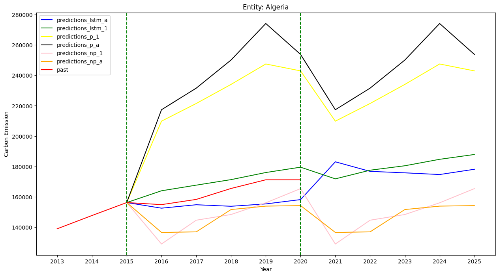
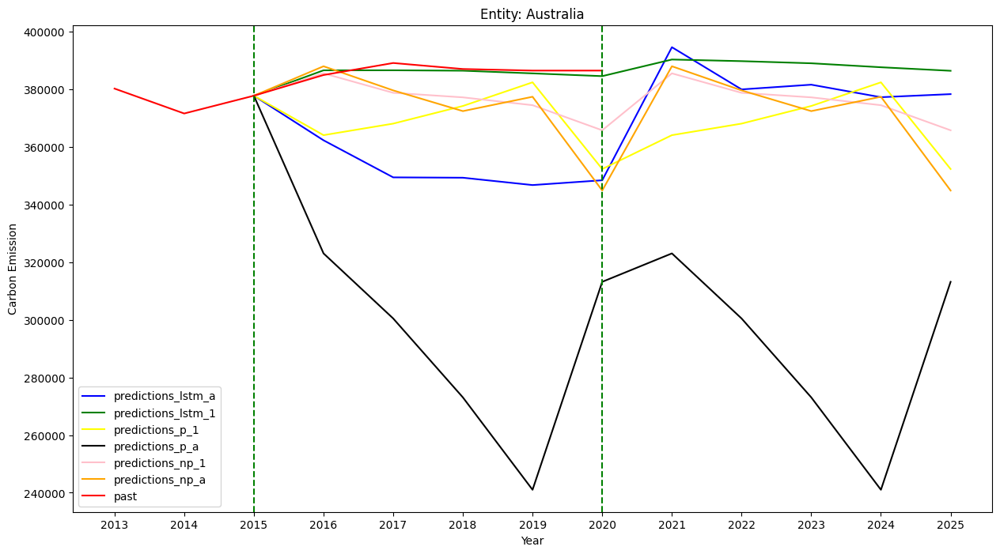
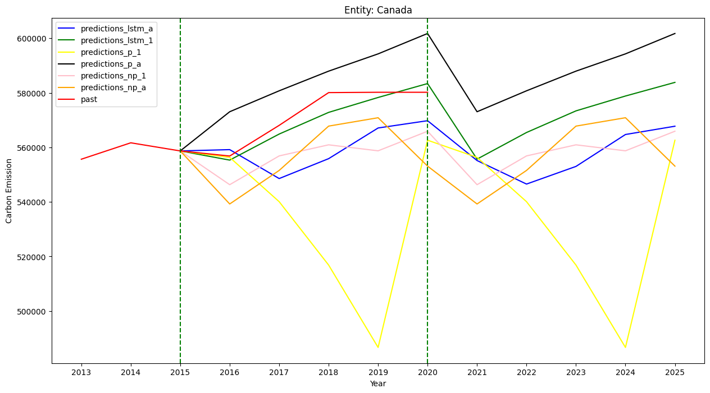
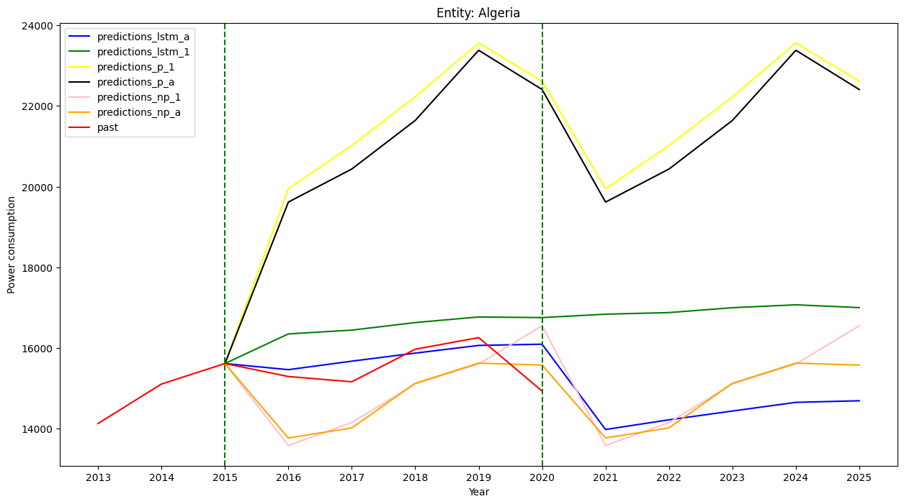
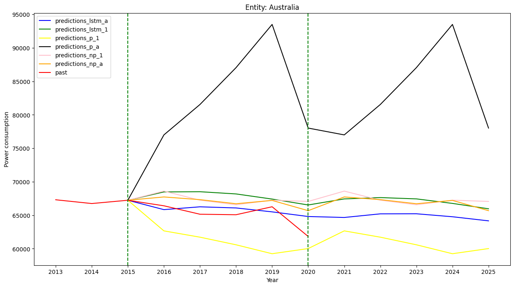
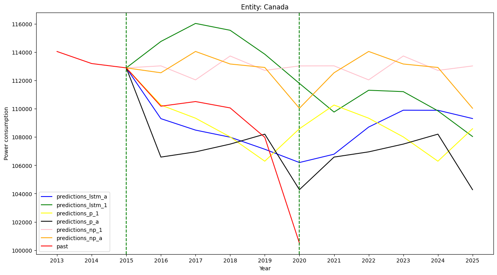

# Time series forecasting for annual power consumption and carbon emission-
Time series forecasting for annual power consumption and carbon emission in different Countries/Areas. 

Data source: https://www.kaggle.com/datasets/anshtanwar/global-data-on-sustainable-energy

The dataset contains annual data from over 150 countries/areas (in the dataset are called Entities) worldwide about many different aspects such as power consumption, carbon emission, GDP, etc.

To predict power consumption and carbon emission for each Entity, time series forecasting models will be used in combination with time series observations in the dataset, univariate time series models will only use target past data to predict and multivariate will use all provided observations (feature engineering may be improved later to increase performance)
Currently built models (will continue to test new models in the future):
* LSTM (Long short-term memory) encoder-decoder for Univariate time series (UTS)
* LSTM encoder-decoder for Multivariate time series (MTS)
* Facebook prophet for UTS
* Facebook prophet for MTS (using add_regressor)
* Neural prophet for UTS (3 lags AR window)
* Neural prophet for MTS (3 lags AR window for both target and other observations)

Results predictions for 3 Countries, Algeria, Australia, and Canada: Predictions are from 2016 to 2025, the red line is ground truth.

| Fig 1                        | Fig 2                          | Fig 3                          |
|---------------------------------|---------------------------------|---------------------------------|
|              |              |              |
| *carbon emission in Algeria from 2016-2025*                | *carbon emission in Australia from 2016-2025*                | *carbon emission in Canada from 2016-2025*                |

| Fig 4                        | Fig 5                          | Fig 6                          |
|---------------------------------|---------------------------------|---------------------------------|
|              |              |              |
| *Power consumption in Algeria from 2016-2025*                | *Power consumption in Australia from 2016-2025*                | *Power consumption in Canada from 2016-2025*                |

The test notebook for forecasting power consumption using all features can fail when running locally, my suggestion is to use google-colab to ensure the demo. The reason is that the model used in this notebook is trained by google-colab. In case to run it locally, please install the requirements for the correct environment, or retrain the model and use it to do the test.
